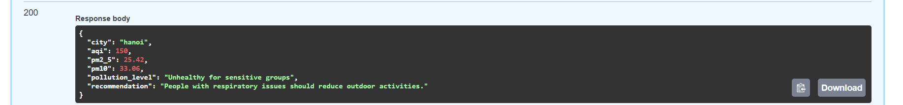

# Air Quality API test

## Mục tiêu
Mục tiêu của test này là xây dựng một API giúp người dùng kiểm tra chất lượng không khí bằng cách nhập vào tên thành phố và mã quốc gia. API sẽ gọi dữ liệu từ dịch vụ bên thứ ba 
```sh
https://api.openweathermap.org/
```
, phân tích mức độ ô nhiễm và cung cấp đánh giá cùng khuyến nghị phù hợp.

**End User**: Người dùng quan tâm đến chất lượng không khí.

## Hiểu đề + Hướng giải quyết
- API nhận thông tin vị trí (tên thành phố, mã quốc gia) do người dùng nhập vào.
- Gọi API bên thứ ba (IQAir hoặc OpenWeatherMap) để lấy dữ liệu chất lượng không khí, bao gồm AQI, PM2.5, PM10.
- Phân loại mức độ ô nhiễm dựa trên chỉ số AQI.
- Trả về đánh giá về mức độ ô nhiễm và đưa ra khuyến nghị phù hợp.
- Đóng gói API vào Docker container để dễ dàng triển khai.

## Getting Started
1. Clone repository.
```sh
git clone https://github.com/NguyenHuuQuangMinh/BackEndTest
```
2. Change Directory
```sh
cd BackEndTest
```
3. Cài đặt các dependencies
```sh
pip install -r requirements.txt
```
4. Chạy API
```sh
uvicorn main:app --host 0.0.0.0 --port 8000
```

## Docker Setup
1. Build Docker image
```sh
docker build -t air-quality-api .
```
2. Run container
```sh
docker run -p 8000:8000 air-quality-api
```
3. Xây dựng Docker Image cho Frontend
```sh
cd BackEndTest\air-quality-ui
docker build -t air-quality-ui .
```
4. Chạy Frontend Container
```sh
docker run -p 3000:3000 air-quality-ui
```
5. Sau khi chạy xong, truy cập ứng dụng tại
```sh
API: http://localhost:8000
```
```sh
Giao diện UI: http://localhost:3000
```

## API Endpoint
- **`POST /air_quality`**
  - **Ouput JSON:**
    ```json
    {
    "detail": [
        {
        "type": "missing",
        "loc": [
            "query",
            "city"
        ],
        "msg": "Field required",
        "input": null
        },
        {
        "type": "missing",
        "loc": [
            "query",
            "country"
        ],
        "msg": "Field required",
        "input": null
        }
    ]
    }
    ```
=> vì Dùng hàm get
- **`POST /docs`**
Sẽ xuất hiện giao diện

- Bước 1: click vào "try it out"
- Bước 2: Nhập vào city và country 
- Bước 3: Sẽ hiển thị ra thông tin cần truy suất


- **`POST /air_quality?city=Hanoi&country=VN`**
- **Output JSON:**
    ```json
    {
      "city": "Hanoi",
      "aqi": 85,
      "pm2_5": 35.0,
      "pm10": 50.0,
      "pollution_level": "Moderate",
      "recommendation": "Limit outdoor activities if you are sensitive to air pollution."
    }
    ```
## Phân loại mức độ ô nhiễm
- AQI từ 0-50: **Tốt** (Good)
- AQI từ 51-100: **Trung bình** (Moderate)
- AQI từ 101-150: **Không tốt cho nhóm nhạy cảm** (Unhealthy for Sensitive Groups)
- AQI từ 151-200: **Không tốt** (Unhealthy)
- AQI từ 201-300: **Rất không tốt** (Very Unhealthy)
- AQI trên 300: **Nguy hiểm** (Hazardous)

## Test API
Sử dụng `test_main.py` để kiểm thử API:
```sh
pytest test_main.py
```

## UI - React Integration
Để chạy giao diện hiển thị chất lượng không khí bằng React:
1. Chuyển đến thư mục giao diện:
```sh
cd BackEndTest\air-quality-ui
```
2. Cài đặt dependencies:
```sh
npm install
```
3. Chạy ứng dụng:
```sh
npm start
```
Nó sẽ hiển thị ra màn hình chính 

=> Nếu như nhập sai dữ liệu 

=> Nếu như nhập đúng dữ liệu
sẽ có một số ví dụ như sau: 


Card giao diện sẽ thay đổi màu tuỳ theo 
Truy cập giao diện tại:
```
http://localhost:3000
```

---
Dự án này giúp người dùng dễ dàng kiểm tra chất lượng không khí, cung cấp đánh giá và khuyến nghị để bảo vệ sức khỏe.
